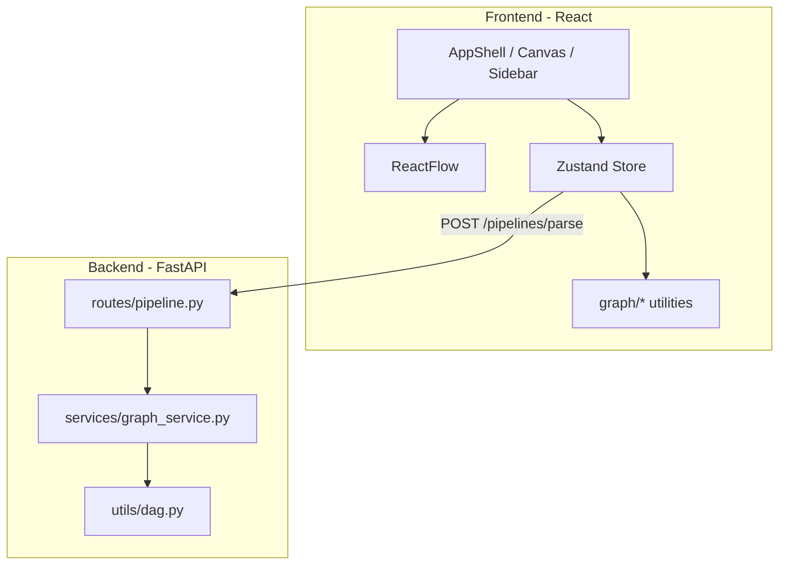

# AI Pipeline Builder

A polished, portfolio-ready visual AI workflow editor inspired by Langflow, Flowise, and modern automation tools. Design pipelines as directed graphs, validate DAG structure live, preview execution visually, and persist workflows as JSON — without real AI execution or auth infrastructure.

## Overview

AI Pipeline Builder lets you:

- Drag nodes onto a canvas and connect them with edges
- Configure node parameters and dynamic Text node variables (`{{name}}`)
- Validate pipeline structure in real time (cycles, isolation, invalid edges)
- Submit graphs to a FastAPI backend for DAG analytics
- Preview execution order with animated node/edge highlights
- Export/import workflows and load starter templates
- Switch between light and dark themes

## Architecture



### Frontend stack

| Layer | Technology |
|-------|------------|
| UI | React (CRA) |
| Canvas | ReactFlow |
| State | Zustand |
| Styling | CSS variables (design tokens) |

### Backend stack

| Layer | Technology |
|-------|------------|
| API | FastAPI |
| Validation | Pydantic |
| Graph algorithms | DFS cycle detection, connectivity analysis |

## Project structure

```
.
├── frontend/
│   ├── src/
│   │   ├── components/       # AppShell, BaseNode, panels, header
│   │   ├── nodes/            # Thin config-driven node wrappers
│   │   ├── graph/            # analytics, validators, execution, persistence
│   │   ├── api/              # backend client
│   │   └── styles/           # theme.css, app.css
│   └── package.json
└── backend/
    ├── main.py
    ├── routes/pipeline.py
    ├── services/graph_service.py
    ├── models/pipeline_models.py
    └── utils/dag.py
```

## Features

### Node system

- **BaseNode** abstraction: config-driven fields, handles, and layout
- **9 node types**: Input, Text, LLM, Output, Delay, Math, Filter, API, Image
- **Text node intelligence**: `{{variable}}` parsing → dynamic input handles
- **Node inspector**: Figma-style property panel when a node is selected

### Validation system

- Live frontend validation (cycles, isolated/disconnected nodes, invalid edges)
- Connection rules (no self-loops, duplicates, pipeline semantics)
- Visual feedback on nodes and edges

### Backend DAG analysis

- `POST /pipelines/parse` with `{ nodes, edges }`
- Returns counts, DAG validity, cycle detection, connectivity metrics
- Parity comparison in the analytics panel

### Execution preview

- Topological sort + timed visual simulation
- Run / Pause / Resume / Step / Reset
- Node activation and edge traversal styling (no real execution)

### Workflow persistence

- **Export** → `workflow.json` (nodes, edges, metadata, positions, data)
- **Import** with structure validation
- **Templates**: LLM pipeline, API flow, Math pipeline

### UX polish

- Light / dark theme (persisted in `localStorage`)
- Keyboard shortcuts: Delete, Ctrl+S, Ctrl+A, F
- Improved minimap, grid, and canvas theming

## Setup

### Frontend

```bash
cd frontend
npm install
npm start
```

Open [http://localhost:3000](http://localhost:3000).

Optional: `REACT_APP_API_URL=http://localhost:8000`

### Backend

```bash
cd backend
python -m venv .venv
.\.venv\Scripts\activate   # Windows
pip install -r requirements.txt
uvicorn main:app --reload --port 8000
```

API docs: [http://localhost:8000/docs](http://localhost:8000/docs)

## Usage

1. Load a **template** from the sidebar or build a pipeline manually.
2. Connect nodes; watch **live analytics** in the right panel.
3. Click **Analyze pipeline** to compare with backend results.
4. Click **Run** in the execution section to preview traversal.
5. **Export** workflow JSON (Ctrl+S) or **Import** a saved file.
6. Select a node to open the **Node Inspector**.
7. Toggle **Light/Dark** in the header.

## Screenshots

Add captures under `docs/screenshots/` for your portfolio:

| File | Description |
|------|-------------|
| `editor-dark.png` | Main editor (dark mode) |
| `editor-light.png` | Main editor (light mode) |
| `validation.png` | Invalid graph + analytics warnings |
| `execution.png` | Execution preview in progress |
| `inspector.png` | Node inspector panel |

## API contract

**POST** `/pipelines/parse`

```json
{
  "nodes": [{ "id": "text-1", "type": "text" }],
  "edges": [{ "id": "e1", "source": "a", "target": "b", "sourceHandle": "...", "targetHandle": "..." }]
}
```

**Response**

```json
{
  "num_nodes": 4,
  "num_edges": 3,
  "is_dag": true,
  "cycle_detected": false,
  "isolated_nodes": 0,
  "disconnected_nodes": 0
}
```

## Design principles

- Zustand as the single source of truth for graph state
- Graph logic centralized under `frontend/src/graph/`
- Thin node wrappers; shared UI via BaseNode / NodeField / NodeHandle
- Immutable store updates for ReactFlow stability
- Backend validators mirror frontend semantics for parity

## License

MIT (or your preferred license).
