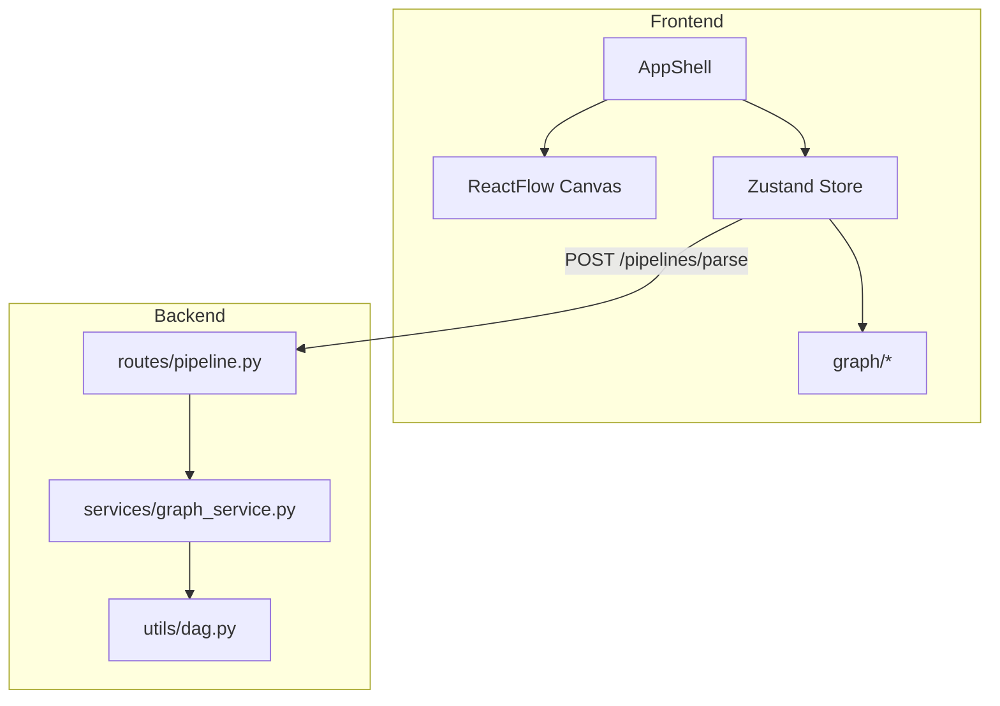

# AI Pipeline Builder

A polished, portfolio-ready visual AI workflow editor inspired by Langflow, Flowise, and modern automation platforms. Design pipelines as directed graphs, validate structure in real time, preview execution visually, and persist workflows locally — without authentication, databases, or real AI execution.

## Overview

**AI Pipeline Builder** is a full-stack demonstration of a lightweight workflow product:

- Drag-and-drop nodes on a ReactFlow canvas
- Connect steps to define data flow and execution order
- Configure nodes via inline fields and a Figma-style **Node Inspector**
- Parse `{{variables}}` in Text nodes to generate dynamic handles
- Validate DAG structure live and via a FastAPI backend
- Simulate execution with animated node/edge highlights
- Export/import workflows as JSON
- Switch between **light** and **dark** themes

This project was built as a technical assessment showcase, but the architecture is intentionally product-oriented: reusable nodes, centralized graph utilities, and a design system that scales beyond the demo scope.

## Features

| Area | Capabilities |
|------|----------------|
| **Node system** | Config-driven `BaseNode`, 9 node types, shared `NodeField` / `NodeHandle` |
| **Dynamic variables** | Text templates with `{{name}}` → live `var-*` handles + edge sync |
| **Live validation** | Cycles, isolated/disconnected nodes, invalid edges (with reasons) |
| **Backend DAG** | `POST /pipelines/parse` — topology analytics with frontend parity |
| **Execution preview** | Topological simulation, Run/Pause/Step/Reset, speed control |
| **Persistence** | Export/import `workflow.json` (nodes, edges, positions, data) |
| **Themes** | Light/dark via CSS variables, persisted in `localStorage` |
| **Templates** | LLM pipeline, API flow, Math pipeline — one-click load |
| **Node inspector** | Right panel switches to property editor when a node is selected |
| **Shortcuts** | Delete, Ctrl+S export, Ctrl+A select all, F fit view |

## Architecture



### Frontend

- **React** (Create React App)
- **ReactFlow** — canvas, edges, minimap, controls
- **Zustand** — graph state, analytics, execution preview, theme

### Backend

- **FastAPI** — modular routes, services, Pydantic models
- **Graph algorithms** — DFS cycle detection, connectivity, topological ordering (frontend)

### Core concepts

1. **BaseNode architecture** — nodes are thin wrappers + JSON config (title, fields, handles).
2. **Config-driven nodes** — new nodes mostly declare config, not bespoke JSX.
3. **Deterministic handles** — stable IDs (`text-1-output`, `var-user`) for validation and import.
4. **Graph analytics** — `graph/analytics.js` + `graph/validators.js` (node-level vs handle-level checks).
5. **Execution preview** — `graph/executionPreview.js` simulates traversal without running APIs.

## Project structure

```
VectorShift/
├── frontend/
│   └── src/
│       ├── components/     # AppShell, BaseNode, panels, header
│       ├── nodes/            # Node wrappers (config only)
│       ├── graph/            # analytics, validators, execution, persistence
│       ├── api/              # backend client
│       ├── styles/           # theme.css (tokens), app.css (components)
│       └── theme/            # initTheme + localStorage
├── backend/
│   ├── main.py
│   ├── routes/pipeline.py
│   ├── services/graph_service.py
│   ├── models/pipeline_models.py
│   └── utils/dag.py
└── docs/screenshots/         # Add portfolio captures here
```

## Key features by phase

| Phase | Deliverable |
|-------|-------------|
| **0** | Stabilized Zustand store, immutable updates, centralized node data |
| **1** | AppShell layout, dark theme foundation |
| **2** | `BaseNode` / `NodeField` / `NodeHandle` abstraction |
| **3** | Five utility nodes (Delay, Math, Filter, API, Image) |
| **4** | Text node variables, dynamic handles, edge sync |
| **5** | Live validation, analytics panel, connection UX |
| **6** | FastAPI DAG parse endpoint + frontend parity |
| **7** | Execution preview simulation |
| **8** | Themes, save/load, inspector, templates, shortcuts, README |

## Screenshots

Add captures under `docs/screenshots/` (see `docs/screenshots/README.md`):

| Placeholder | Description |
|-------------|-------------|
| `editor-dark.png` | Main editor — dark theme |
| `editor-light.png` | Main editor — light theme |
| `validation.png` | Analytics + invalid edge details |
| `execution.png` | Execution preview in progress |
| `inspector.png` | Node inspector panel |

## Setup

### Prerequisites

- Node.js 18+
- Python 3.10+

### Frontend

```bash
cd frontend
npm install
npm start
```

Open [http://localhost:3000](http://localhost:3000).

Optional environment variable:

```bash
REACT_APP_API_URL=http://localhost:8000
```

### Backend

```bash
cd backend
python -m venv .venv
.\.venv\Scripts\activate    # Windows
# source .venv/bin/activate  # macOS/Linux
pip install -r requirements.txt
uvicorn main:app --reload --port 8000
```

- API: [http://localhost:8000](http://localhost:8000)
- Docs: [http://localhost:8000/docs](http://localhost:8000/docs)

## Usage quick start

1. Pick a **template** from the sidebar or build from scratch.
2. Connect nodes; watch **live analytics** update.
3. Click **Analyze pipeline** to compare with backend results.
4. **Run** execution preview to see traversal animation.
5. **Export** workflow (header or Ctrl+S) / **Import** JSON.
6. Select a node to edit in the **Inspector**.
7. Toggle **Light/Dark** in the header.

## API

**POST** `/pipelines/parse`

```json
{
  "nodes": [{ "id": "text-1", "type": "text" }],
  "edges": [{ "id": "e1", "source": "a", "target": "b" }]
}
```

**Response**

```json
{
  "num_nodes": 4,
  "num_edges": 3,
  "is_dag": true,
  "cycle_detected": false,
  "isolated_nodes": 0,
  "disconnected_nodes": 0
}
```

## Design system

All UI colors flow through semantic tokens in `frontend/src/styles/theme.css`:

- `--bg-primary`, `--surface-primary`, `--text-primary`
- `--accent-primary`, `--success`, `--warning`, `--error`
- Component tokens for controls, edges, execution states, ReactFlow chrome

Toggle theme via header; preference is stored in `localStorage` under `ai-pipeline-builder-theme`.

## Future improvements

- Real workflow execution engine (LLM/API calls, retries, caching)
- Collaborative editing and presence
- Workflow versioning and diffing
- Typed port schemas and connection rules per data type
- Cloud persistence (optional — out of scope for this demo)

## License

MIT (or your preferred license).
